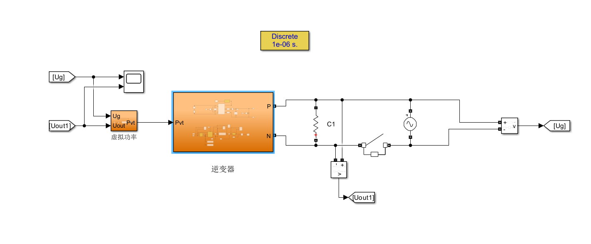
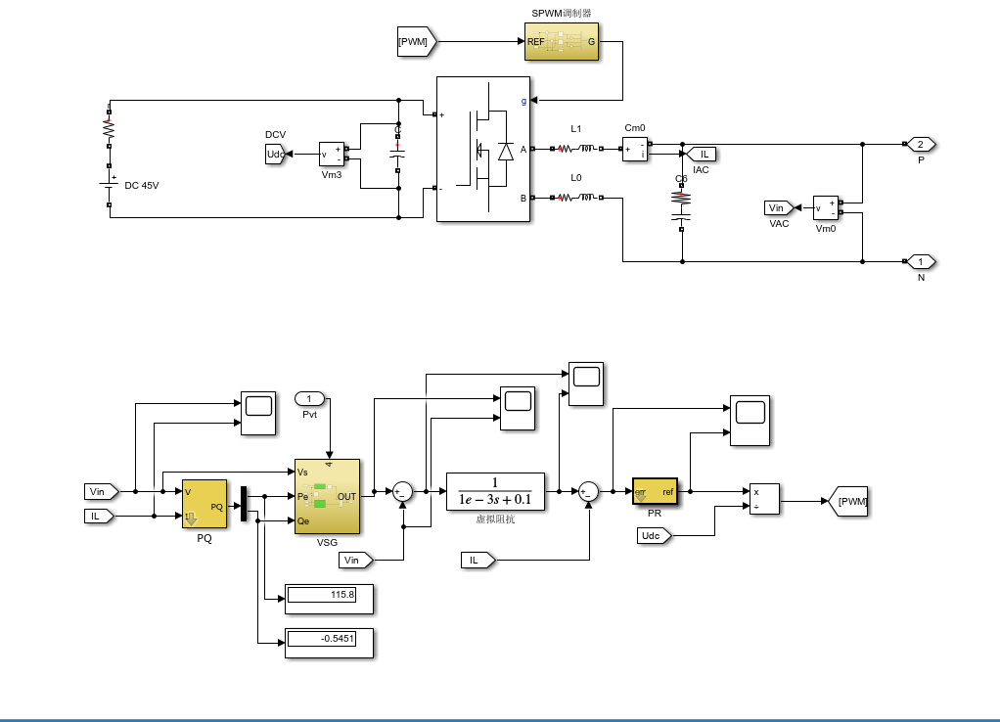
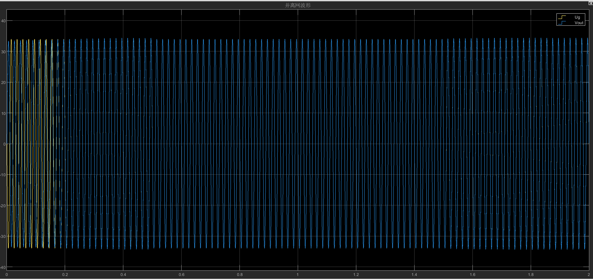

# VSG-Model
# 🔌 单相VSG逆变器仿真（MATLAB/Simulink）

## 📌 项目简介

本项目基于 MATLAB / Simulink 搭建单相虚拟同步发电机（VSG, Virtual Synchronous Generator）逆变器仿真模型，实现逆变器的**构网型控制策略（Grid-Forming Control）**。

通过引入同步发电机的惯性与阻尼特性，使逆变器具备类似传统电机的动态响应能力，提高系统稳定性。

---

## 🎯 项目目标

* 实现单相逆变器的VSG控制策略
* 构建完整的**功率环（P–ω）与电压环（Q–E）控制结构**
* 验证系统在负载变化下的动态响应与稳定性
* 搭建SPWM调制与滤波输出电路模型

---

## 🧠 系统架构

本模型主要由以下几个部分组成：

### 1️⃣ 功率计算模块（PQ）

* 实时计算有功功率 P 和无功功率 Q
* 为VSG控制提供反馈量

### 2️⃣ VSG控制器

* 模拟同步发电机摆动方程
* 引入虚拟惯量与阻尼
* 输出频率与电压参考

### 3️⃣ 虚拟阻抗环节

* 抑制电流冲击
* 提高系统稳定性与抗干扰能力

### 4️⃣ PR控制器

* 用于单相系统电流跟踪
* 提高交流稳态误差性能

### 5️⃣ SPWM调制模块

* 将控制信号转换为PWM驱动信号
* 控制逆变桥开关动作

### 6️⃣ LC滤波与输出

* 滤除高频开关谐波
* 输出稳定正弦电压

---

## ⚙️ 关键技术点

* VSG控制（虚拟同步发电机建模）
* 功率解耦控制（P–ω，Q–E）
* PR控制器设计（单相系统）
* SPWM调制技术
* 虚拟阻抗设计
* LC滤波器建模

---

## 📈 仿真说明

* 输入：DC 45V电源
* 输出：单相交流电压
* 可观察变量：

  * 输出电压波形（VAC）
  * 电流波形（IL）
  * 有功/无功功率变化（P/Q）
  * 频率动态响应

---

## 🖼️ 模型示意

## 模型总体结构

## 系统结构

## 输出电压波形

---

## 🚀 如何运行

1. 安装 MATLAB（建议 R2024 及以上）
2. 打开项目中的 `.slx` 文件
3. 点击“Run”运行仿真
4. 通过Scope观察输出波形

---

## 💡 项目亮点（面向硬件/电源岗位）

* 掌握构网型逆变器核心控制思想（VSG）
* 具备电力电子系统建模与仿真能力
* 理解从控制算法 → PWM → 功率电路的完整链路
* 可迁移至DSP（如C2000）进行工程实现

---

## 🔧 后续优化方向

* 优化PR参数，提高动态响应性能
* 引入数字控制（离散化实现）
* 在DSP平台（如TI C2000）进行实机验证

---

## 👨‍💻 作者

* 电气工程及其自动化专业
* 方向：电力电子 / 逆变器控制 / DSP开发

---

## 📬 说明

本项目为个人学习与工程实践项目，可用于展示电力电子控制与仿真能力。

